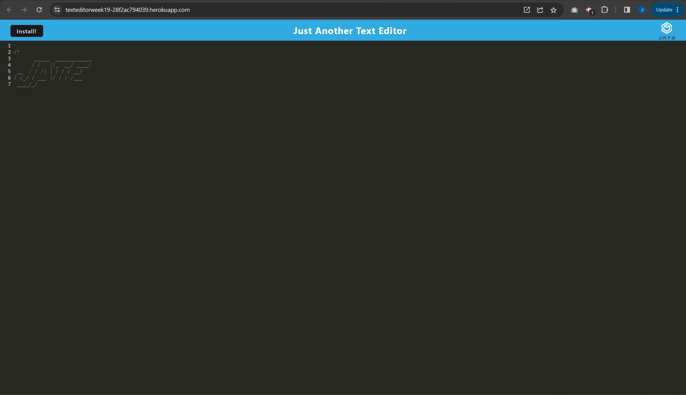
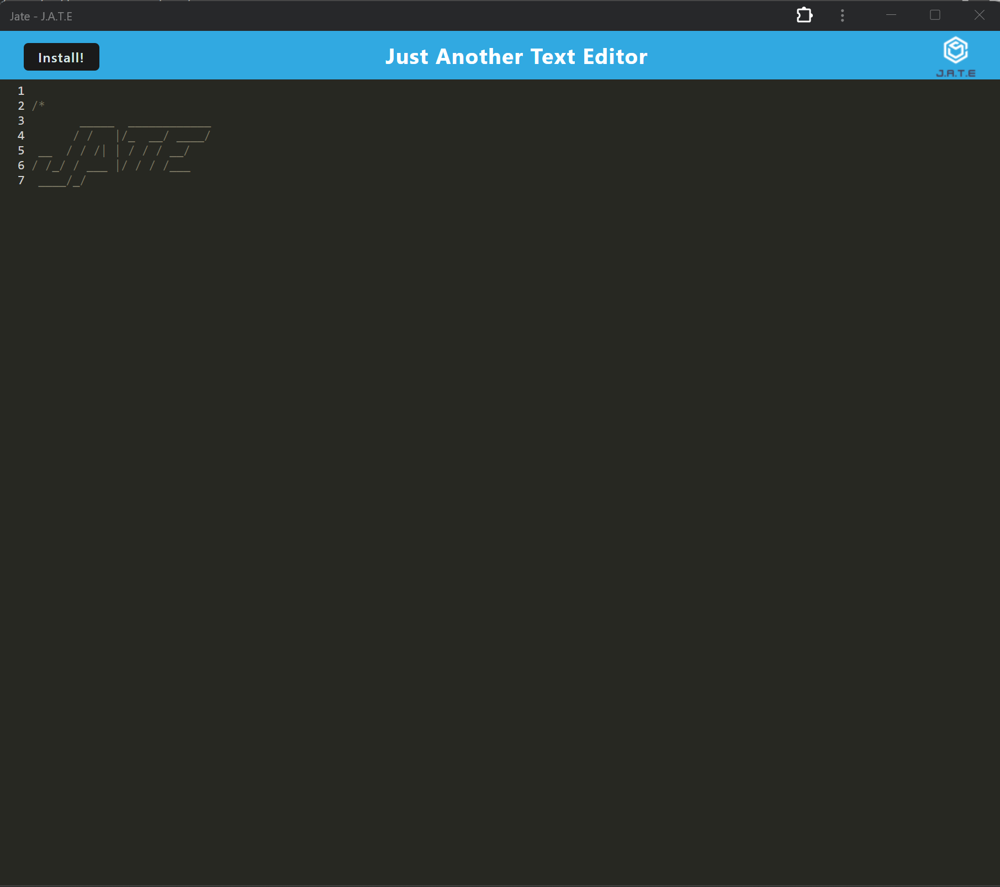
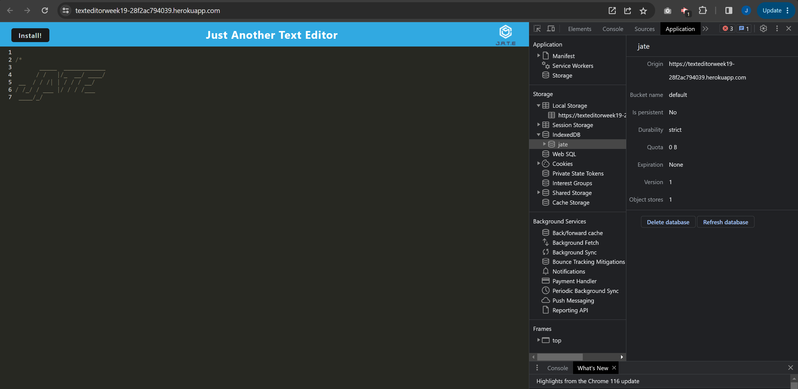

# PWA-Text-Editor (Progressive Web Applications)

## Description 
This is a PWA Text Editor. It allows the user to run the application and make notes in the browser and offline.

## Deployed Application
Please see the following application by clicking, [here!](https://texteditorweek19-28f2ac794039.herokuapp.com/)


## Screenshots

This is a screenshot of the text-editor open in the browser via heroku.


Here is a screenshot of the text-editor once installed and open from the desktop.


Here is a screenshot of the text-editor showing IndexedDB


## Table of contents
- [Go to Technologies](#technologies-used)
- [Go to Installation](#installation) 
- [Go to Usage](#usage) 
- [Go to Contributing](#contributing) 
- [Go to Tests](#tests)
- [Go to License](#license)
- [Go to Questions](#questions)

## Technologies Used
In this application, I have used the following technologies:
- IndexedDB as the database <br>
- Webpack to handle the front-end<br>
- Heroku for deployment
- Workbox to create the service worker

## Installation
To install the dependencies for the application, please run the following command in the terminal  
```
npm i
```
    
## Usage
After running ```npm i``` to use the application, in the command line type the following.<br>
1. ```npm run build``` - this will bundle the front end code <br>
2. ```npm run start``` - this will start the server<br>
3. Go to the port on your local host to view the application.

## Contributing
N/A

## Tests
N/A

## License
N/A


## Questions

Please checkout my Github account: https://github.com/Joshua-Watson96 

Please e-mail me with any further questions:  joshjkwatson@gmail.com